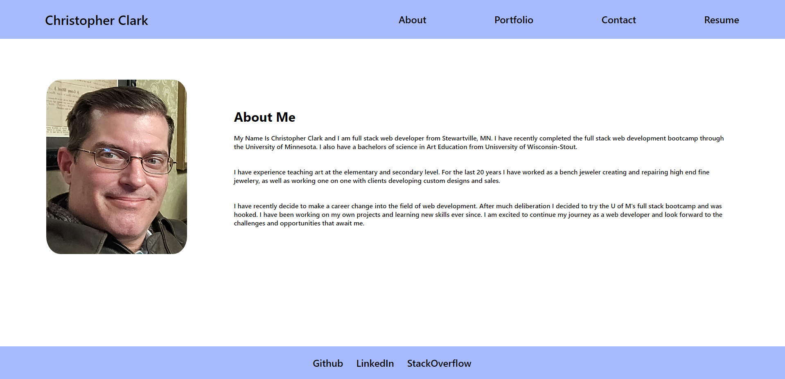
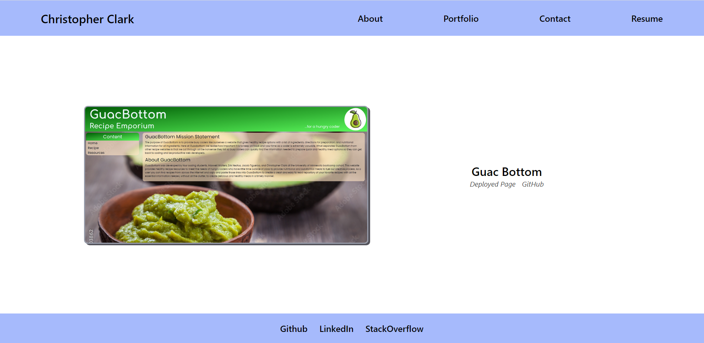
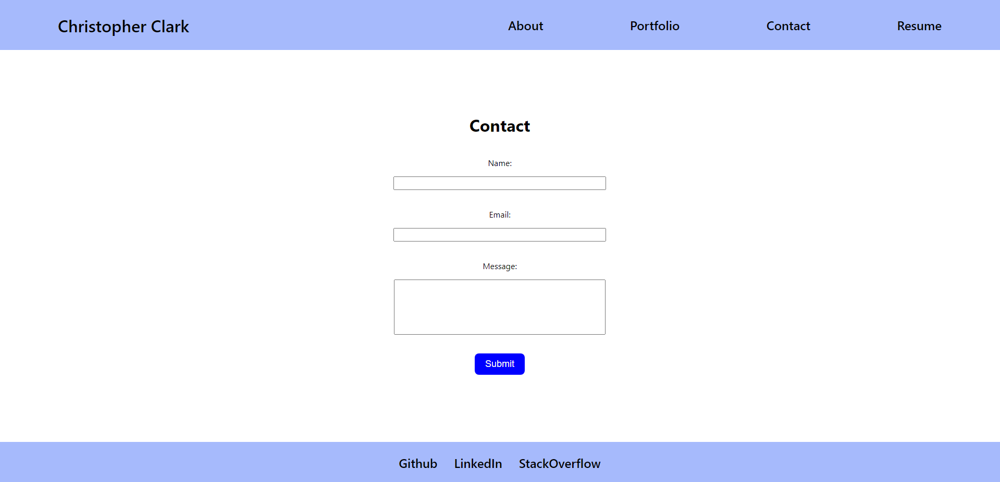
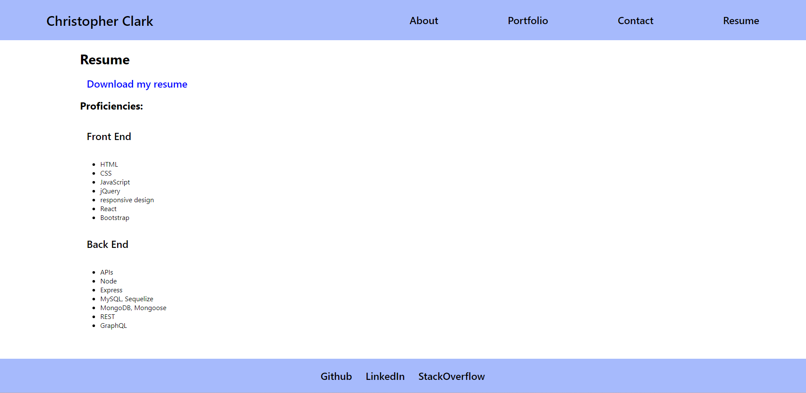

# My React Portfolio

## Project Goal

The goal of this challenge was to create a portfolio using our new React skills and gain experience building a single-page application that is deployed to GitHub Pages.

## Deployed Link on Github Pages

[Click here to see My-React-Portfolio deployed on Github Pages.](https://christopherrclark.github.io/my-react-portfolio/)

### Screen Shots

